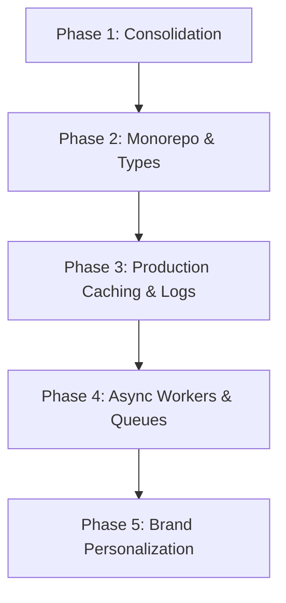

# Otaru — *Garments worth keeping.*

Otaru is a headless, luxury digital fashion archive and storefront built with Next.js 15, Shopify Storefront API, and Sanity CMS. It is designed to bridge tactile physical garments with an immersive, high-performance digital narrative.

---

## 🏛️ Brand & Architectural Identity

Otaru operates as an editorial design house. To maintain this premium positioning, the codebase enforces a strict domain-specific vocabulary and token-driven design rules.

### Domain Vocabulary Mapping (§1.11)

To protect the brand narrative, standard e-commerce terminology is mapped to luxury terms across the UI:

| Standard Commerce | Otaru Domain Term | Code Mapping |
| :--- | :--- | :--- |
| Product | **Artifact** | `/artifact/[handle]` |
| Collection | **Chapter** | `/chapter/[slug]` |
| Catalog | **Archive** | `/archive` |
| Blog / Articles | **Journal** | `/journal` |
| About Us | **Studio** | `/studio` |
| New Arrivals | **Latest Chapter** | Home section |
| Sold Out | **Archive Sold** | Badge / Detail status |

*Clarifying terms such as `bag`, `checkout`, `price`, and `size` remain in plain text to ensure operational clarity.*

---

## ⚡ Implemented Technical Features

### 1. Edge-Level Security Core
Configured inside [middleware.ts](file:///c:/Users/namir/OneDrive/Desktop/otaru/otaru-/src/middleware.ts):
*   **IP-Based Rate Limiting**: Edge-compatible sliding token bucket rate limiter to guard against API spam and bot vectors.
*   **CSRF Guard**: Validates request origins against host headers on all mutating (`POST`, `PUT`, `DELETE`) operations.
*   **Cryptographic Script Nonces**: Generates a cryptographically random nonce per request, securing scripts from cross-site injection vectors.
*   **Secure Response Headers**: Strictly configures HTTP Strict Transport Security (`HSTS`), clickjacking guards (`X-Frame-Options: DENY`), MIME-sniffing protection (`X-Content-Type-Options: nosniff`), and feature permission blocks.

### 2. Tactile 3D Material Specimen Inspector
Located in [three/](file:///c:/Users/namir/OneDrive/Desktop/otaru/otaru-/src/components/three/):
*   Utilizes **React Three Fiber** and **Drei** to load interactive, high-density WebGL material specimins (e.g., custom 14.5oz selvage denim weaves).
*   Supports live toggling between shaded material preview and wireframe "weave structure" modes.
*   Uses Next.js dynamic loads (`ssr: false`) and suspends seamlessly on mobile viewports.

### 3. Physical-Digital Provenance & NFC Scanning
Located in [provenance/](file:///c:/Users/namir/OneDrive/Desktop/otaru/otaru-/src/components/provenance/):
*   Integrates the browser **Web NFC API** (`NDEFReader`) allowing users to tap physical tags on their garments to verify authenticity certificates.
*   Features a mock browser simulator to demonstrate NFC reads on incompatible devices and desktops.

### 4. Embedded CMS Editor
*   Mounts **Sanity Studio v3** inside [app/studio/](file:///c:/Users/namir/OneDrive/Desktop/otaru/otaru-/src/app/studio/) as a catch-all route, enabling unified content editing and page drafts directly inside the frontend host.

---

## 🗺️ Architectural Roadmap (Startup Blueprint)

This blueprint details our roadmap for scaling the storefront to support high traffic volumes, multiple developers, and premium operational standards.



### Phase 1: Repository Consolidation (Immediate)
*   Promote the inner `otaru-` codebase to the root workspace.
*   Remove redundant configurations (`next.config.mjs`, legacy `src`, duplicate `package.json`).
*   Establish a single, clean workspace environment.

### Phase 2: Monorepo & Schema Sync
*   **Turborepo Setup**: Transition the repository to a Turborepo + `pnpm` workspaces structure to isolate `apps/web` (storefront), `apps/studio` (CMS), and shared design system packages.
*   **Type Generation Pipeline**: Establish a pipeline to compile GROQ schemas directly into TypeScript types and Zod validation schemas for end-to-end API type safety:
    $$\text{Sanity Schema} \xrightarrow{\text{Codegen}} \text{TypeScript Types} \xrightarrow{\text{Zod}} \text{Runtime Validation}$$

### Phase 3: Observability & Caching
*   **Observability Matrix**: Integrate OpenTelemetry, structured JSON logging, and Sentry exception capture at the Edge.
*   **Multi-Tier Caching**: Wire a Redis caching tier in front of Shopify & Sanity APIs to minimize third-party query latency and API costs:
    $$\text{Client Request} \rightarrow \text{Edge Cache} \rightarrow \text{Redis} \rightarrow \text{CMS / Shopify API}$$

### Phase 4: Async Workers & Queues
*   **Background Workers**: Configure background queues (e.g., BullMQ or Inngest) to handle webhook processing (Shopify inventory, Shiprocket status, Klaviyo flows) asynchronously.

### Phase 5: Immersive Experience & AI
*   **Extended 3D & NFC**: Expand the 3D scene catalog and garment lifecycle tracking.
*   **AI Merchandising**: Add semantic search and personalized storytelling pipelines.

---

## 🛠️ Local Development

### 1. Setup Environment
Copy the example environment file:
```bash
cp .env.local.example .env.local
```
*If environment variables are left empty, Otaru defaults to a local mock data state (`src/lib/sanity/mocks.ts` and `src/lib/shopify/mocks.ts`) so you can test routes, 3D, and NFC without live keys.*

### 2. Install & Start
```bash
npm install
npm run dev
```

### 3. Run Verification Tests
```bash
npm run test
```
